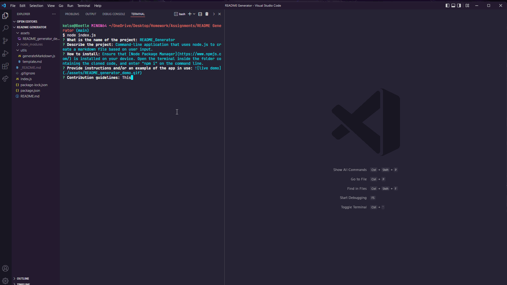

# README_Generator

## Description

Command-line application that uses node.js to create a markdown file based on user input.

## Table of Contents

- [Installation](#installation)
- [Usage](#usage)
- [Contact](#contact)
- [License](#license)

## Installation

Ensure that [Node Package Manager](https://www.npmjs.com/) is installed in your IDE. Open the terminal inside the folder containing the cloned code, and enter "npm i" on the command line.

## Usage

## Contact

Find more projects at [github.com/freyaliesel](https://github.com/freyaliesel)
For questions, email [freyacodes@gmail.com](mailto:freyacodes@gmail.com)

## License

Copyright (C) 2022 K Glidden

The owner of this project has not yet selected a license.

If interested in using any part of this code, please contact the project owner.